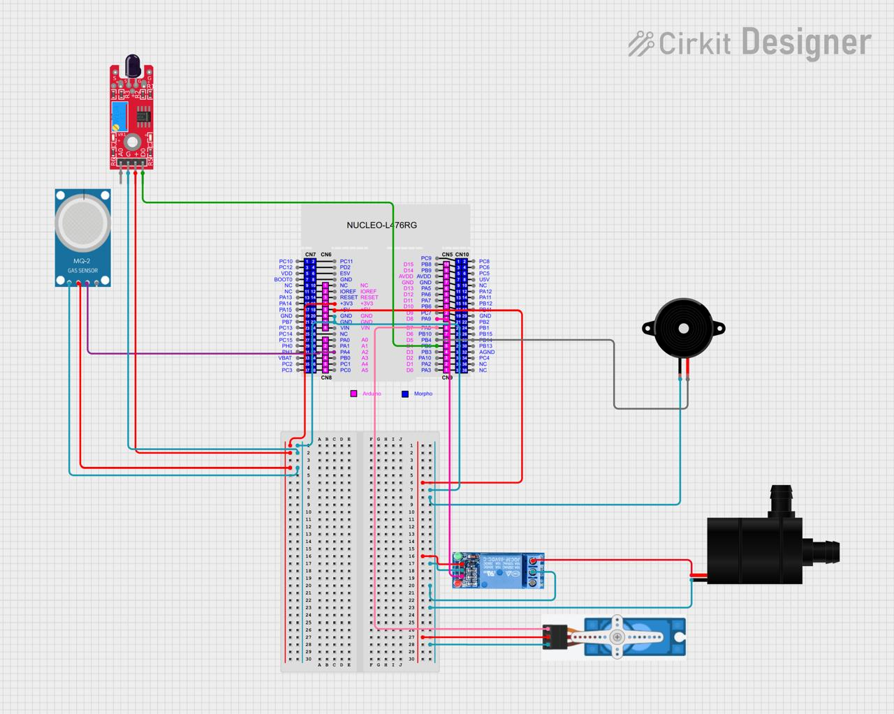

# Automated-Fire-Detection-and-Extinguishing
This is an embedded systems project done on the Nucleo board (LG476RG). The project is a fire detection system that will periodically sense the environment using two sensors, flame and smoke. Once a fire is present, the tasks will release a semaphore to alert the actuators. A buzzer will actively alert the user, a relay will control a water pump to spray water, and a servo motor will actively sweep at angles between 0 and 180 to extinguish the detected area. 
All components are coded and scheduled as tasks using FreeRTOS.

## System Block Diagram

The block diagram shows how all the components interact. Input sensors are responsible for sensing the environment, and actuators are responsible for producing the action.

## System Circuit Diagram

In the circuit diagram, you can see how all the components are connected and interfaced with the Nucleo board. Bread breadboard has been used to expand the power supply and ground connections from the board. 

Below is the list of all components used:
1. KY-026 Flame Sensor
2. Smoke Sensor - MQ-2
3. DC 3-5V Mini Water Pump
4. Towerpro Micro Servo Motor, SG90, Blue
5. 5V 1-Channel Relay Board Module
